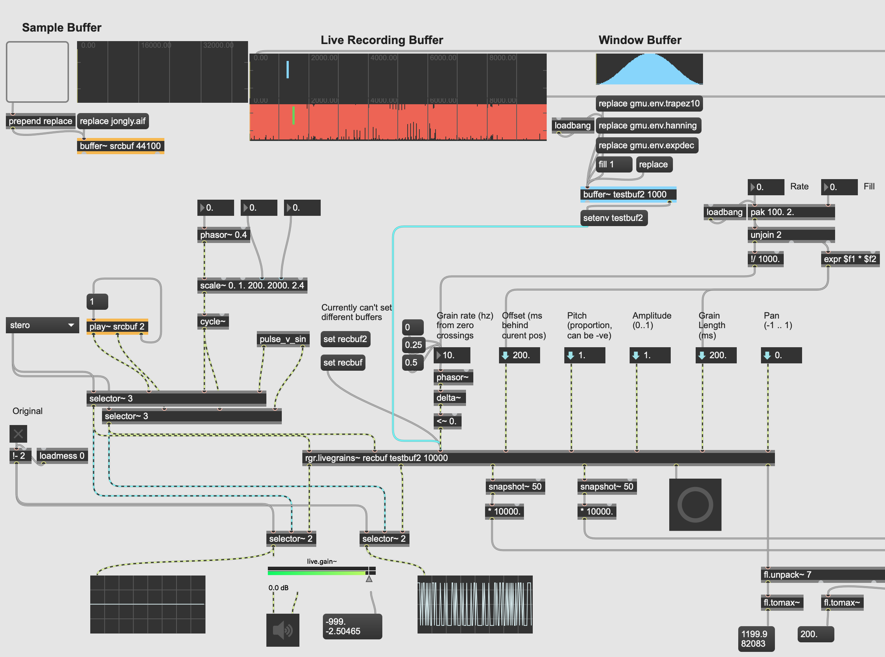

# rgr.grains

Recreation of the GMU GMEM granulators using FrameLib. A fairly straight up grain engine that allows for flexible trigggering of grains, variable envelopes, a bit of panning etc. As far as possible everything is done with signals, and it should be capable of perfect reconstruction.

There are two versions:
- `rgr.bufgrains~` plays back grains from a buffer
- `rgr.livegrains~` plays grains from a circular recording buffer
Both of them have a rough `.maxhelp` for simple usage.

Roughly, they take as input:
- (audio signals in for the live version)
- trigger (signal where any nonzero value will trigger a grain)
- position (or offset relative to current recording point)
- pitch (1 = original, 2 = octave up, 0.5 = octave down, -1 = backwards)
- grain amplitude (0..1)
- grain length (ms)
- pan (-1 .. 1)

You get out:
- stereo signals full of grains
- record/playback positions (on the live version)
- other info

# Examples
- In the `examples` folder, `MinimalLiveGranulator.amxd` is a Max for Live device that will granulate incoming audio along some fairly simple lines.
- [GranularSynth](https://github.com/mo-seph/GranularSynth) uses the buffer version of this as it's core.

